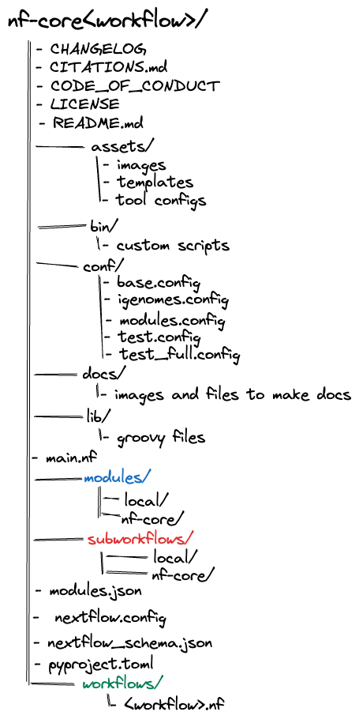
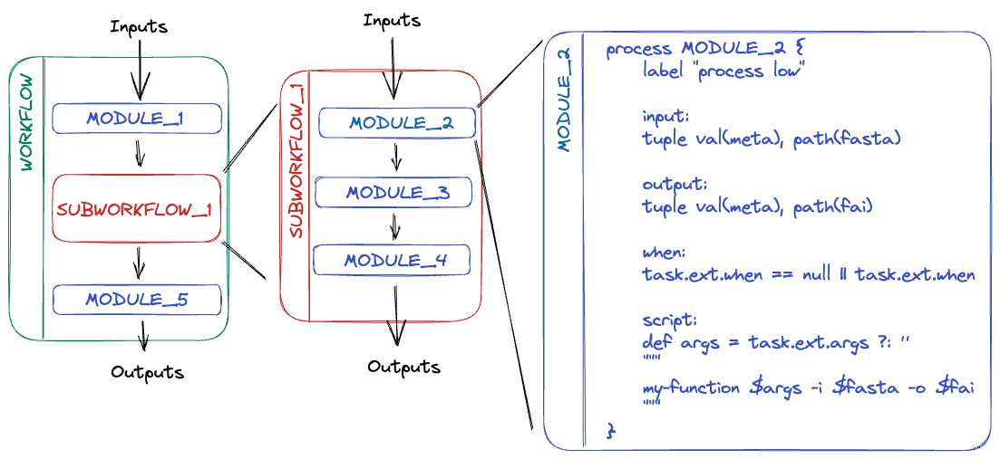

# Pipeline structure

!!! clipboard-list "Objectives"

    - Learn about the structure of an nf-core pipeline.

## Pipeline structure

nf-core pipelines follow a set of best practices and standardised conventions. nf-core pipelines start from a **common template** and follow the same structure. Although you won’t need to edit code in the pipeline project directory, having a basic understanding of the project structure and some core terminology will help you understand how to configure its execution.

Nextflow DSL2 **workflow** are built up of **subworkflows** and **modules** that are stored as separate `.nf` files.

 

 
 

Most nf-core pipelines consist of a single **workflow** file (there are a few exceptions). This is the main `<workflow>.nf` file that is used to bring everything else together. Instead of having one large monolithic script, it is broken up into a combination of **subworkflows** and **modules**.

 

 
 

A **subworkflows** is a groups of modules that are used in combination with each other and have a common purpose. For example, the [`SAMTOOLS_STATS`](https://github.com/nf-core/modules/blob/master/modules/nf-core/samtools/stats/main.nf), [`SAMTOOLS_IDXSTATS`](https://github.com/nf-core/modules/blob/master/modules/nf-core/samtools/faidx/main.nf), and [`SAMTOOLS_FLAGSTAT`](https://github.com/nf-core/modules/blob/master/modules/nf-core/samtools/flagstat/main.nf) modules are all included in the [`BAM_STATS_SAMTOOLS`](https://github.com/nf-core/modules/blob/master/subworkflows/nf-core/bam_stats_samtools/main.nf) subworkflow.

Subworkflows improve pipeline readability and help with the reuse of modules within a pipeline. Within a nf-core pipeline, a subworkflow can be an nf-core subworkflow or as a local subworkflow. Like an nf-core pipeline, an nf-core subworkflow is developed by the community is shared in the [nf-core subworkflows GitHub repository](https://github.com/nf-core/modules/tree/master/subworkflows/nf-core). Local subworkflows are pipeline specific that are not shared in the nf-core subworkflows repository.

A **modules** is a wrapper for a process, the basic processing primitive to execute a user script. It can specify [directives](https://www.nextflow.io/docs/latest/process.html#directives), [inputs](https://www.nextflow.io/docs/latest/process.html#inputs), [outputs](https://www.nextflow.io/docs/latest/process.html#outputs), [when statements](https://www.nextflow.io/docs/latest/process.html#when), and a [script](https://www.nextflow.io/docs/latest/process.html#script) block.

Most modules will execute a single tool in the script block and will make use of the directives, inputs, outputs, and when statements dynamically. Like subworkflows, modules can also be developed and shared in the [nf-core modules GitHub repository](https://github.com/nf-core/modules/tree/master/modules/nf-core) or stored as a local module. All modules from the nf-core repository are version controlled and tested to ensure reproducibility. Local modules are pipeline specific that are not shared in the nf-core modules repository.

